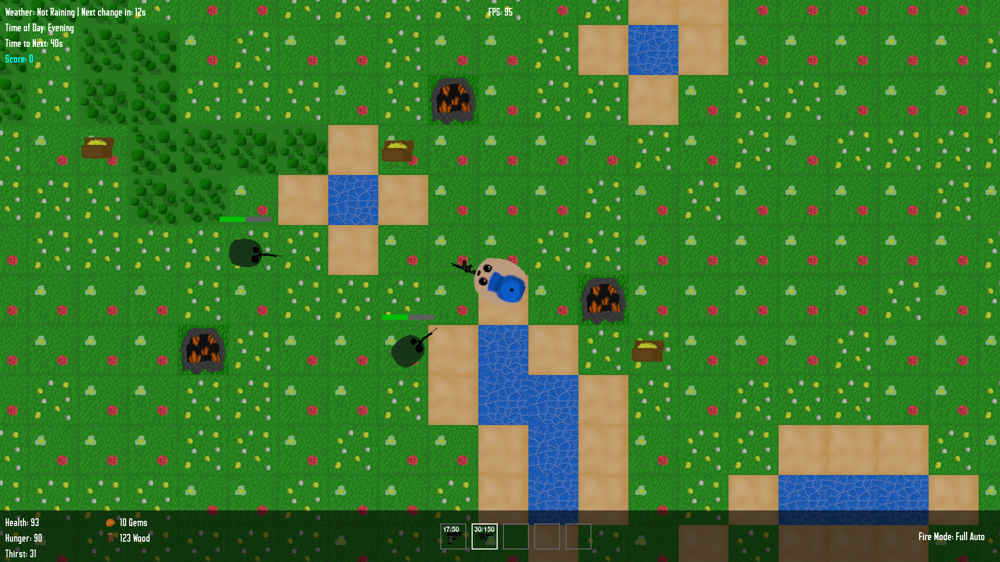

<h1>About</h1>
Storm Survival is a realistic real-time apocalypse survival game. Gather resources, fight enemies and loot for weapons. Get stronger every day and with every wave of enemies. Explore the open world and enjoy the cutting edge pixel art graphics our graphic design team prepared for you. We hope you enjoy our game and have a pleasant experience. 

<h1>Controls:</h1>

W, A, S, D - Move

Esc - Quick Settings

E - Interact

LMB - Shoot

R - Reload

F - Drop Weapon

B - Change Fire Mode

1, 2, 3, 4, 5 - Navigate Hotbar

Q - Enter/Exit Building Mode

RMB - (While in Building Mode) Place Wall

<h1>Mechanics:</h1>

Press 1, 2, 3, 4 or 5 to Select a slot in the Hotbar

Press E to Open/Close a Chest

Click On the Weapon Inside a Chest to Hold it

While Holding a Weapon Click on Your Hotbar to Equip

Click LMB While Having Selected an Ammo Box or Ammo Crate to add ammunition to chosen Weapon

Hold E Near a Forest - Place Wood Farm

Hold E Near a Mine - Place Crystal Farm

Hold E Near Water - Drink Water

Press E Near a Wood Farm to Gather Wood and Food

Press E Near a Crystal Farm to Gather Crystals

You Need 25 Gems to Open a Chest

You Need 100 Wood to Place a Crystal Farm

You Need 10 Wood to Build a Wall

Drinking Water and Gathering Food Raises your Thirst and Hunger

When Gathering Food while Hunger is full, Health will raise Proportionally

!!! Health, Thirst and Health will not Rise above 100
